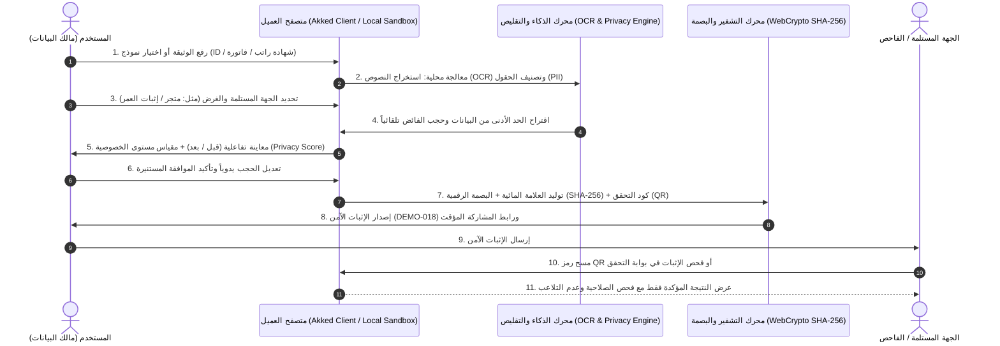

# أكد (Akked) — Personal Data & Consent Guardian
## وثيقة المشروع والمواصفات الفنية والأكاديمية لمشروع التخرج
### "حارس البيانات الشخصية والموافقات" | "Personal Data & Consent Guardian"

---

## 1. ملخص تنفيذي وبيان المشكلة والحل المقترح (Problem Statement & Proposed Solution)

### 1.1 المشكلة الواقعية (The Problem)
في العصر الرقمي الحالي، يضطر الأفراد يومياً لمشاركة وثائقهم الرسمية الثبوتية (مثل الهوية الوطنية، جواز السفر، كشف الحساب البنكي، شهادة الراتب، عقود الإيجار، وفواتير الشراء) مع جهات متعددة (متاجر إلكترونية، مكاتب عقارية، شركات تأجير السيارات، مراكز الصيانة، ومنصات التوظيف).

تكمن المشكلة الجوهرية في الآتي:
1. **الإفراط في مشاركة البيانات (Over-sharing / Excessive Data Disclosure):** إذا طلبت جهة التأكد من أن عمر المستخدم أكبر من 18 عاماً لشراء منتج معين، يُجبر المستخدم على إرسال صورة كاملة من بطاقة الهوية الوطنية متضمنة (الاسم الكامل، رقم الهوية، تاريخ الميلاد الدقيق، مكان الميلاد، العنوان الوطني، وصورته الشخصية).
2. **فقدان السيادة على البيانات (Loss of Data Sovereignty):** بمجرد إرسال الوثيقة عبر البريد الإلكتروني أو تطبيقات المحادثة أو البوابات، يفقد المستخدم القدرة على تتبع من اطلع عليها، وأين تم تخزينها، ومتى ستُحذف، أو منع استخدامها في غير غرضها الأصلي.
3. **مخاطر تسريب البيانات وانتحال الهوية (Identity Theft & Data Breaches):** تخزين آلاف الوثائق الكاملة غير المشفرة في خوادم الشركات غير المتخصصة يجعلها صيداً سهلاً للهجمات السيبرانية.
4. **عدم الامتثال للأنظمة الحديثة لحماية البيانات الشخصية:** تخالف الممارسات التقليدية مبدأ "الحد الأدنى من البيانات" (Data Minimization) المنصوص عليه في نظام حماية البيانات الشخصية السعودي (PDPL) واللائحة العامة لحماية البيانات الأوروبية (GDPR).

### 1.2 الحل المقترح: منصة "أكد" (Proposed Solution: Akked)
منصة **"أكد"** هي حارس رقمي شخصي للبيانات والموافقات (Personal Data & Consent Guardian) تعمل وفق مبدأ **"الخصوصية أولاً ومشاركة الحد الأدنى من البيانات للغرض المحدد والجهة المحددة والمدة المحددة"**.

تقوم المنصة بتمكين المستخدم من:
- رفع الوثيقة محلياً على جهازه دون رفعها لخوادم مركزية غير موثوقة.
- استخدام الذكاء الاصطناعي وتقنيات التعرف الضوئي (OCR) لتحديد وتصنيف كافة الحقول الحساسة (PII).
- تحديد الحد الأدنى الضروري من البيانات المطلوب إثباته بناءً على الغرض والجهة (مثل: إثبات العمر 18+ فقط، إثبات نطاق الراتب فقط، إثبات سريان الضمان فقط).
- حجب وإخفاء وتشفير كافة البيانات الزائدة آلياً عبر محرك إخفاء ذكي (Interactive Redaction Engine).
- توليد "إثبات موثق وآمن" يحمل علامة مائية ديناميكية مخصصة باسم الجهة والغرض، ورمز استجابة سريعة (QR Code) للتحقق الفوري، وبصمة رقمية مشفرة (SHA-256 Hash) لمنع التلاعب، مع تحديد فترة صلاحية ذاتية الإلغاء وإمكانية سحب الصلاحية فوراً.

---

## 2. أهداف المشروع والقيمة المضافة (Project Objectives & Value Proposition)

### 2.1 أهداف المشروع (Objectives)
1. **تمكين سيادة الفرد على بياناته:** تحويل المستخدم من طرف سلبي تنتهك خصوصيته إلى صاحب القرار الأول والأخير في تحديد ما يراه الآخرون.
2. **تحقيق الامتثال لمبدأ تقليص البيانات (Data Minimization by Design):** تطبيق معايير أنظمة الخصوصية (Saudi PDPL & GDPR) برمجياً وعملياً.
3. **منع إعادة استخدام الوثائق المسربة:** تقييد كل وثيقة أو إثبات بجهة واحدة محددة وغرض حصري وتاريخ انتهاء إجباري عبر علامة مائية مضمنة غير قابلة للإزالة.
4. **توفير آلية تحقق مستقلة وذكية:** تمكين الجهات المستلمة من التحقق من صحة الإثبات وتكامل البصمة الرقمية دون الحاجة لتخزين أو الاطلاع على بيانات حساسة لا تعنيهم.

### 2.2 القيمة المضافة ومقارنة الحل بالحلول التقليدية (Value Proposition & Comparison)

| وجه المقارنة | الطرق التقليدية (إرسال الوثيقة كاملة / PDF / صور) | منصات إدارة الوثائق المؤسسية (Enterprise DMS) | منصة "أكد" (Akked Guardian) |
| :--- | :--- | :--- | :--- |
| **محور التحكم والملكية** | الجهة المستلمة تتحكم بالملف | المنظمة وخوادم الشركات | **الفرد والمستخدم نفسه (User-Centric)** |
| **حجم البيانات المكشوفة** | 100% من الوثيقة (تسريب هائل) | بحسب صلاحيات الموظف بالشركة | **الحد الأدنى فقط (Minimum Necessary Data)** |
| **الخصوصية والتشفير** | منعدمة (تداول عبر الإيميل/الواتساب) | تشفير في خوادم الشركة المستضيفة | **معالجة محلية كاملة على جهاز المستخدم** |
| **تقييد الغرض والجهة** | لا يوجد (يمكن إعادة توجيه الملف لأي شخص) | محصور ببيئة العمل الداخلية | **علامة مائية وبصمة مشفرة مخصصة لجهة وغرض محددين** |
| **إمكانية الإلغاء (Revocation)** | مستحيلة بعد الإرسال | داخل النظام فقط | **إلغاء فوري بضغطة زر مع انتهاء صلاحية مؤقت** |
| **التحقق من التلاعب** | صعب وبحاجة لفحص بصري بشري | سجل تدقيق داخلي | **بصمة تجزئة SHA-256 ورمز QR ذكي** |

---

## 3. حالات الاستخدام الرئيسية للمشروع الأولي (Main Use Cases)

### 1. إثبات الأهلية العمرية (Age Verification 18+ Only)
- **السيناريو:** متجر إلكتروني أو مزود ألعاب يطلب التأكد من أن المشتري فوق 18 عاماً لمنتج مقيد عمرياً.
- **البيانات التقليدية المكشوفة:** صورة بطاقة الهوية كاملة (رقم الهوية، الاسم، الصورة، تاريخ الميلاد، العنوان).
- **إثبات "أكد":** شهادة مشفرة تفيد: `[مؤهل: المستخدم فوق 18 عاماً]` مع حجب رقم الهوية وتاريخ الميلاد والاسم والصورة بالكامل، وتخصيص الإثبات باسم المتجر لمدة 10 دقائق فقط.

### 2. إثبات الملاءة المالية أو التوظيف للتأجير والعقارات (Employment & Rental Proof)
- **السيناريو:** منصة عقارية أو مؤجر يطلب إثبات أن دخل المستأجر يتجاوز 7,000 ريال شهرياً وأن عقد عمله سارٍ.
- **البيانات التقليدية المكشوفة:** شهادة الراتب الكاملة مع تفاصيل الحسميات، رقم الحساب البنكي (IBAN)، الرقم الوظيفي، وتفاصيل صاحب العمل السرية.
- **إثبات "أكد":** إثبات موثق يؤكد: `[الحالة الوظيفية: نشط | الدخل: يتجاوز الحد المطلوب (نطاق > 7,000 ريال)]` مع إخفاء رقم الـ IBAN، المسمى الوظيفي الدقيق، والراتب التفصيلي.

### 3. إثبات صلاحية الضمان والشراء (Warranty & Purchase Verification)
- **السيناريو:** مركز صيانة يطلب التحقق من سريان ضمان جهاز إلكتروني بناءً على فاتورة الشراء.
- **البيانات التقليدية المكشوفة:** الفاتورة كاملة (رقم البطاقة الائتمانية، العنوان، الاسم، باقي المنتجات المشتراة، والسعر الإجمالي).
- **إثبات "أكد":** وثيقة مظللة تُظهر فقط: `[اسم المنتج، الرقم التسلسلي، تاريخ الشراء]` وتطمس بيانات الدفع والشخصية والمنتجات الأخرى تماماً.

---

## 4. رحلة المستخدم وسير العمل التقني (User Journey & System Workflow)

---

## 5. التوظيف العملي لتقنيات الذكاء الاصطناعي (Practical Use of AI)

1. **التعرف الضوئي على الحروف المتعدد اللغات (Multilingual OCR - Arabic & English):**
   - استخراج النصوص والإحداثيات المكانية (Bounding Boxes) للكلمات والأرقام بدقة باللغتين العربية والإنجليزية.
2. **التعرف على الكيانات المسماة وتصنيف البيانات الحساسة (PII Named Entity Recognition & Classification):**
   - تصنيف تلقائي للحقول المستخرجة إلى فئات: (رقم الهوية الوطنية، الاسم الكامل، تاريخ الميلاد، الصورة الشخصية، الدخل المالي، رقم الـ IBAN، أرقام البطاقات البنكية، العنوان الوطني).
3. **محرك الاستدلال وقواعد تقليص البيانات (Minimum Necessary Inference Engine):**
   - مطابقة نوع الغرض مع الحقول اللازمة فقط، وتطبيق تحويلات تقليص ذكية (Data Transformation) مثل:
     - تحويل `تاريخ الميلاد (1998/04/12)` إلى قيمة منطقية `(فوق 18 عاماً: نعم)`.
     - تحويل `الراتب الدقيق (14,350 ريال)` إلى نطاق ملاءمة `(أعلى من 7,000 ريال)`.
     - تحويل `رقم الآيبان الكامل` إلى صيغة مقنعة `(**** **** **** 4892)`.
4. **فحص الخصوصية وحساب مؤشر الحماية (Privacy Scan & Score Algorithm):**
   - احتساب معادلة رياضية ديناميكية:
     $$\text{Privacy Score} = \left( 1 - \frac{\text{Exposed Sensitive Fields}}{\text{Total Sensitive Fields}} \right) \times 100$$
   - تنبيه المستخدم في حال بقاء أي حقل حساس غير ضروري في حالة العرض.
5. **محرك الحجب والتعتيم الرسومي على المتصفح (Canvas-Level Smart Redaction):**
   - تطبيق طبقات حجب متقدمة (تعتيم أسود صلب Blackout، تشويش Gaussian Blur، تقطيع بكسلي Pixelation، أو استبدال رمزي Tokenization) مباشرة على بكسلات الصورة لمنع استرجاع النص الأصلي من خلال تفكيك طبقات الملف.

---

## 6. المتطلبات الوظيفية وغير الوظيفية (Functional & Non-Functional Requirements)

### 6.1 المتطلبات الوظيفية (Functional Requirements)
- **FR-01 (إدارة الوثائق المحلية):** دعم رفع ومعالجة المستندات بصيغ (PNG, JPG, PDF) وقوالب تجريبية واقعية جاهزة.
- **FR-02 (المعالجة والتقليص الذكي):** كشف الحقول الحساسة وعرض توصيات تقليص البيانات بناءً على الغرض.
- **FR-03 (المعاينة التفاعلية للمقارنة):** توفير شريط سحب ومقارنة (Before / After Split View) قبل اعتماد المشاركة.
- **FR-04 (العلامة المائية المؤرخة المقيدة):** طباعة علامة مائية غير قابلة للإزالة تتضمن: اسم الجهة المصرح لها، الغرض، تاريخ الإنشاء، وتاريخ وساعة الانتهاء.
- **FR-05 (البصمة الرقمية ومكافحة التلاعب):** توليد هاش SHA-256 فريد وتضمين رمز QR مرتبط بسجل الإثبات.
- **FR-06 (جدول ومراقبة المشاركات):** لوحة تحكم تعرض المشاركات النشطة، المنتهية، وتتيح الإلغاء الفوري (Revoke Share).
- **FR-07 (سجل الجهات الموثوقة):** استعراض الجهات المعتمدة وتقييم حمايتها وتاريخ المشاركات السابقة معها.
- **FR-08 (خزنة بياناتي ورصد الانكشاف):** عرض تصنيفات البيانات ومستوى الانكشاف وتوفير ميزة مسح الذاكرة المؤقتة بالكامل (Zero-Trace Purge).
- **FR-09 (مركز التنبيهات والأمان):** إشعارات حية حول انتهاء الصلاحية، محاولات التحقق، والأنشطة المشبوهة.
- **FR-10 (بوابة التحقق للجهات):** واجهة مستقلة تتيح للمستلم إدخال رقم الإثبات (مثل `DEMO-018`) لفحص صلاحيته والاطلاع على النتيجة المؤكدة فقط.

### 6.2 المتطلبات غير الوظيفية (Non-Functional Requirements)
- **NFR-01 (الأداء والسرعة):** زمن المعالجة المحلية للوثيقة وتوليد الإثبات يقل عن 1.5 ثانية على أجهزة المستخدمين القياسية.
- **NFR-02 (الأمان وحفظ الخصوصية):** تطبيق مبدأ Zero-Knowledge Architecture؛ لا يتم إرسال الوثيقة الأصلية كاملة إلى خوادم وسيطة.
- **NFR-03 (سهولة الاستخدام والتجربة UX):** دعم ثنائي اللغة كامل (عربي RTL وإنجليزي LTR) مع مظهر نهاري وليلي ونظام لوني جذاب ومتطابق مع الهوية البصرية.
- **NFR-04 (التوافق والاستجابة):** واجهة متجاوبة 100% تعمل على شاشات الجوال، الأجهزة اللوحية، والشاشات المكتبية.

---

## 7. متطلبات الأمان والامتثال للخصوصية (Security & Privacy Requirements)
1. **الامتثال لنظام حماية البيانات الشخصية السعودي (Saudi PDPL) و GDPR:**
   - تطبيق المادة المعنية بالحد الأدنى من البيانات (Data Minimization Principle).
   - الموافقة الصريحة والمستنيرة (Explicit & Informed Consent) قبل كل مشاركة.
   - حق الإلغاء والسحب الفوري للموافقة (Right to Revoke Consent).
2. **عدم ادعاء التوثيق الحكومي الرسمي:**
   - التوضيح الصريح في واجهة النظام أن الإثبات هو توثيق خصوصية مشفر بموافقة المستخدم (Personal Cryptographic Assertion) ما لم يكن هناك ربط رسمي مباشر بجهات الإصدار الحكومية.
3. **تشفير البصمة وتكامل البيانات (Data Integrity via SHA-256):**
   - استخدام خوارزميات التجزئة المشفرة في متصفح المستخدم للتحقق من عدم تعرض الصورة المحجوبة لأي تلاعب بعد إصدارها.

---

## 8. الخطة التطويرية والتوسعات المستقبلية (Future Roadmap)
1. **أدلة المعرفة الصفرية (Zero-Knowledge Proofs - ZKP):**
   - استخدام خوارزميات مثل zk-SNARKs لتقديم إثباتات رياضية بحتة دون الكشف عن أي بكسل من الوثيقة الأصلية.
2. **الهويات الرقمية اللامركزية والشهادات القابلة للتحقق (W3C Verifiable Credentials & DID):**
   - تبني معايير الاتحاد العالمي للويب (W3C) لإصدار الشهادات المعتمدة من الجهات المصدرة مباشرة إلى محفظة الفرد الرقمية.
3. **التكامل مع بوابات النفاذ الوطني والهيئات الحكومية (National Digital ID Integration):**
   - الربط عبر واجهات برمجة التطبيقات (APIs) الآمنة للتحقق التلقائي من مصدري الوثائق الرسمية.
4. **العقود الذكية على سلاسل الكتل (Blockchain Consent Auditing):**
   - تسجيل بصمات المعاملات وإلغاء الموافقات على سجل غير قابل للتعديل لضمان الشفافية القانونية للطرفين.

---
*تم إعداد هذه الوثيقة لمشروع التخرج: أكد (Akked) - حارس البيانات الشخصية والموافقات.*
